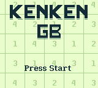
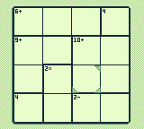

# kenken-gb

`kenken-gb` is a [KenKen](https://en.wikipedia.org/wiki/KenKen) puzzle game for the Game Boy. Solve from a selection of 256 4x4 KenKen puzzles!

<p align="center">
  
  
</p>

## Building

First, make sure you have Python and [RGBDS](https://rgbds.gbdev.io/) installed.

```
$ make puzzles && make
```

Once executed, `kenken.gb` should be produced in the project directory.
